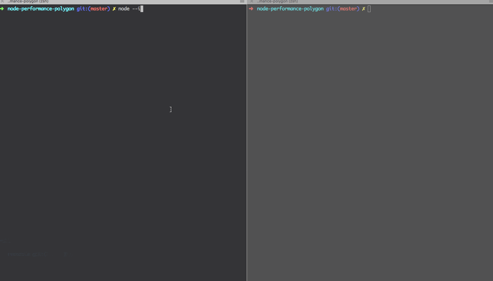

# Node.js Performance Polygon

This is minimalist polygon to lear how to profile Node.js, find memory leaks, high CPU consumption, etc.
It has no dependencies - only pure Node.js

It has the following endpoints:

`server.js`  | endpoint
--- | ---
'/'     | "Hello World" stub (nothing dangerous)
'/leak' | Simple memory leak
'/block'| Block main thread stub


Run server with inspect mode:
```
node --inspect server.js
```

Open the chrome dev-tools:

```
chrome://inspect
```

There you're getting power!

- - -
#### 1. Debug memory leak



- - -
#### Fake request sequence

To not make requests manually you can use Apache Bench tool:

```
ab -k -c 100 -n 20000 http://localhost:7777/
```

Most usefull:
```
n - Number of requests
c - (concurrency)  Number of multiple requests to make
k - Keep Alive connection
```
